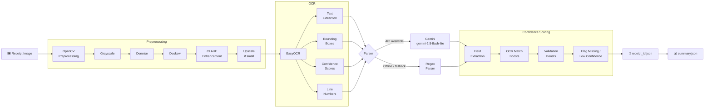

# 🧾 Receipt OCR Pipeline

> Batch pipeline that converts receipt images into structured JSON with confidence scores.



---

## ✨ Features

- **OpenCV preprocessing** — grayscale, blank-image detection, denoise, deskew, CLAHE, and small-image upscaling
- **EasyOCR** with GPU support when available
- **OCR detections** preserve text, bounding boxes, confidence, and visual line numbers
- **Gemini parser** using `gemini-2.5-flash-lite`
- **Regex fallback** for offline runs or API failures
- **Per-field confidence** from OCR matches plus validation boosts
- **Flagging** of missing and low-confidence fields
- **Per-receipt JSON** plus aggregate `summary.json`
- **Unit tests** for parser fallback, confidence scoring, structuring, and summary aggregation

---

## 📁 Project Structure

```
receipt_ocr/
├── main.py
├── preprocess.py
├── ocr.py
├── parser.py
├── confidence.py
├── structurer.py
├── summary.py
├── tests/
├── requirements.txt
├── .env.example
└── README.md
```

---

## ⚙️ Requirements

| Requirement | Details |
|---|---|
| Python | 3.10 or 3.11 recommended |
| GPU | NVIDIA with CUDA 12.1 drivers (recommended) |
| API Key | Gemini API key for Gemini parsing |

> The pipeline can run without an API key using `--no-api`, falling back to the local regex parser.

---

## 🚀 Setup

```powershell
py -3.11 -m venv .venv
.\.venv\Scripts\Activate.ps1
python -m pip install --upgrade pip
pip install -r requirements.txt
copy .env.example .env
```

Edit `.env`:

```env
GEMINI_API_KEY=your_key_here
```

---

## 🖼️ Usage

Place receipt images in `dataset/`:

```
dataset/
  receipt_001.jpg
  receipt_002.png
```

**Run with Gemini parsing:**

```powershell
python main.py --input .\dataset --output .\results --workers 4
```

**Run offline (regex fallback):**

```powershell
python main.py --input .\dataset --output .\results --workers 4 --no-api
```

**Debug flags:**

```powershell
python main.py --input .\dataset --output .\results --verbose --cache-ocr
```

**Supported formats:** `.jpg` `.jpeg` `.png` `.bmp` `.tiff` `.tif` `.webp`

---

## 📄 Output Schema

Each receipt produces `results/<receipt_id>.json`:

```json
{
  "receipt_id": "receipt_001",
  "store_name":    { "value": "TRADER JOES", "confidence": 0.95 },
  "date":          { "value": "2024-06-28",  "confidence": 1.00 },
  "items": [
    { "name": "CARROTS", "price": "1.29", "confidence": 0.88 }
  ],
  "subtotal":      { "value": "4.79", "confidence": 0.91 },
  "total_amount":  { "value": "4.79", "confidence": 0.98 },
  "currency": "USD",
  "flags": [],
  "ocr_avg_confidence": 0.89
}
```

The aggregate `results/summary.json` includes:

```json
{
  "total_receipts": 371,
  "total_spend": 4821.30,
  "currencies_detected": ["USD"],
  "transactions_by_store": {
    "TRADER JOES": { "count": 5, "total": 120.45 }
  },
  "low_confidence_receipts": ["receipt_003"],
  "flagged_fields_count": 12
}
```

---

## 📊 Confidence Logic

| Field | Boost Condition |
|---|---|
| `store_name` | Store appears near the top of the receipt |
| `date` | Value matches a supported date pattern |
| `total_amount` | A total-related keyword is within two visual lines |
| `currency` | Value matches a known ISO 4217 code |
| `items` | OCR matches found for both item name and price |
| *(missing)* | Flagged as `missing:<field>`, score `0.0` |
| *(low)* | Scores below `0.70` flagged as `low_confidence:<field>` |

Base confidence comes from EasyOCR detections that align with each parsed field value.

---

## 🔧 Edge Cases

| Scenario | Handling |
|---|---|
| Skewed images | Corrected with Hough-line deskew + `cv2.warpAffine` |
| Low contrast | Enhanced with CLAHE |
| Blank / unreadable images | Emits an error JSON with flags |
| Missing fields | Emits `null` values with confidence `0.0` and flags |
| Partial receipts | Emits whatever can be extracted |
| Multi-currency | Supports USD, INR, EUR, GBP, and common symbols |

---

## 📈 Results

Full pipeline results on the 371-receipt dataset are documented in [Results.md](Results.MD) — covering success rate, financial extraction, OCR confidence, missing fields, currency distribution, item extraction, and top stores.

---

## 🧪 Tests

```powershell
pytest
```

---

## 🛣️ Challenges & Future Improvements

The core challenge is mapping semantic fields back to OCR evidence. The current implementation keeps EasyOCR bounding boxes and line indexes, then approximates field confidence by matching parsed values back to OCR lines and tokens.

**A stronger production version would:**
- Ask Gemini to return evidence spans or line IDs for every field, making confidence scores more precise
- Expand the regex fallback for better item grouping on messy receipts (currently intentionally conservative for offline/API-outage use)